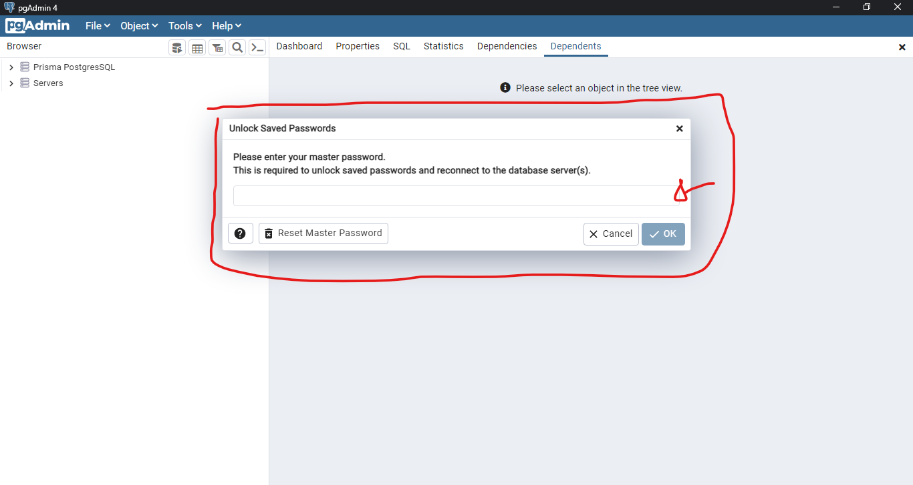
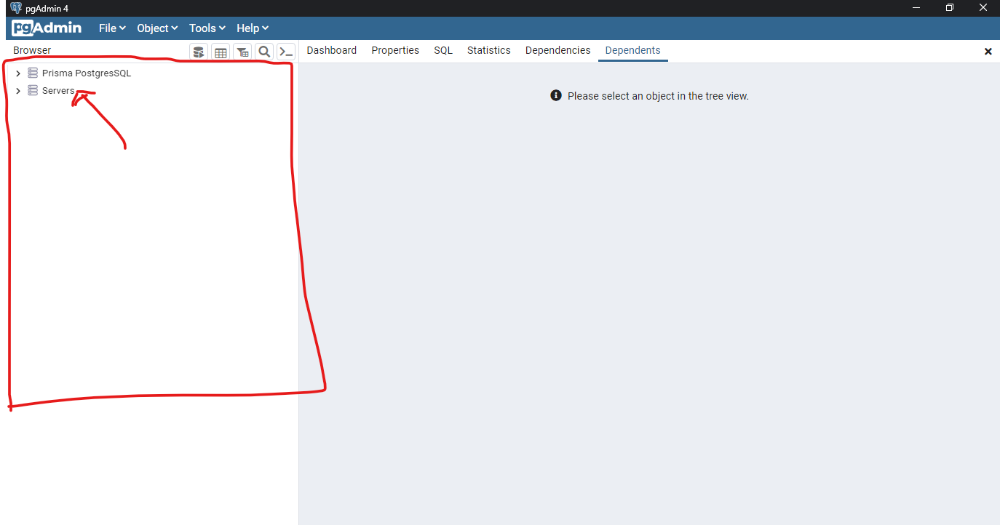
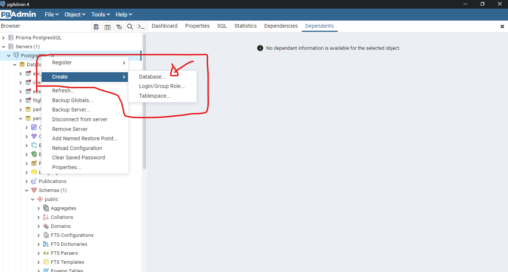
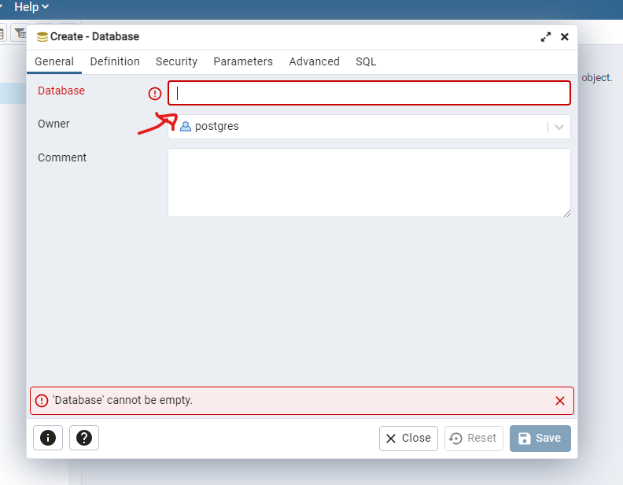

# API para cadastro de pessoas 

## Descrição

Esta API tem como objetivo realizar um CRUD, Create Read, Update, Delete, de cadastro de pessoas. Ela foi construída com
a utilização do [Spring Boot](https://docs.spring.io/spring-boot/docs/current/reference/htmlsingle/) e do [Java 17](https://docs.oracle.com/en/java/javase/17/).

## Tecnologias utilizadas

- Java 17
- Spring Boot 3.1.3
- PostgreSQL 
- Maven

## Dependências Utilizadas
- Spring Web
- Spring Data JPA
- Validation
- PostgreSQL Driver

## Entidade

<pre>
person {
    id: UUID String;
    firstName: String;
    lastName: String;
    cpf: String;
    email: String;
    age: int;
    registrationDate: LocalDateTime;
    }
</pre>

## Configurando o ambiente

- Clone o repositório:
```bash
> git@github.com:AdsonBruno/person-registration.git
```
- Abra o projeto no Intellij
  - Clique em "File" -> "Open"
  - Navegue até onde foi salvo o projeto
  - Clique em "Open"
 
- Se você estiver usando uma versão diferente do JDK da que seja a 17, faça o seguinte:
  - `File` -> `Project Structure`.
  - Na seção `Project`, defina o `Project SDK` para a versão 17 e em seguida clique em `apply`.
  
- Configurando o banco de dados `Postgre`

  (Adicione a senha master para acessar o postgre)


(Selecione um servidor para criar o banco de dados)


(Acesse Create e databse para criar o banco)


(Crie o banco, o nome do banco deve ser informado na aplicação)

`spring.datasource.url=jdbc:postgresql://localhost:5432/nome-do-banco`

## Rodando o projeto

- Para que o projeto possa ser executado, é preciso que primeiro seja criado um banco de dados com o nome "persons" e em
seguida adicionar as credênciais no arquivo "application.properties".
- Execute o comando a seguir, ou, dentro de `pom.xml`, clique em "maven", na barra lateral, e em seguida em `load maven changes`.
```bash
> mvn clean install
```
- Em seguida, procure o main do projeto, `PersonRegistrationApplication` e clique em `run` que o projeto será executado.

### Endpoints:

Endpoint base da aplicação: `http://localhost:8091/

#### `POST` -> `http://localhost:8091/api/persons`
```json
{
  "firstName": "Fernando",
  "lastName": "Castro",
  "cpf": "95724945037",
  "email": "fernando@gmail.com",
  "age": 26
}
```

Response

```json
{
    "id": "ffbefc45-b77e-4a2f-8c0e-4c9d56f3e717",
    "firstName": "Fernando",
    "lastName": "Castro",
    "cpf": "95724945037",
    "email": "fernando@gmail.com",
    "age": 26,
    "registrationDate": "2023-09-05T10:55:01Z"
}
```

Obter a lista paginada de pessoas cadastradas

- OBS.: Adicionei a paginação para que se no futuro essa listagem venha a crescer muito, o acesso ao banco de dados 
mantenha performático e assim a aplicação possa ter sua escalabilidade garantida.

Parâmetros da paginação: 
- page -> número da página
- size -> quantidade de elementos por página
- sort -> ordenação da página

#### `GET` -> `http://localhost:8091/api/persons?page=0`
```json
{
    "content": [
        {
            "id": "0f4ba83f-16c3-4f01-bff8-49f54788ab0c",
            "firstName": "Amy",
            "lastName": "Farrah Fowler",
            "cpf": "51147285047",
            "email": "amy_fowler@gmail.com",
            "age": 26,
            "registrationDate": "2023-09-04T22:41:36Z"
        },
        {
            "id": "196cccd2-6f69-481c-9e8e-08cf334eb8fa",
            "firstName": "Sheldon",
            "lastName": "Cooper",
            "cpf": "66771060047",
            "email": "sheldon@gmail.com",
            "age": 26,
            "registrationDate": "2023-09-04T22:41:34Z"
        },
        {
            "id": "356d1e17-e03f-48c3-90c3-d38137fcb1d3",
            "firstName": "Santos",
            "lastName": "Dumont",
            "cpf": "29648604088",
            "email": "santos_dumont@gmail.com",
            "age": 26,
            "registrationDate": "2023-09-04T12:31:09Z"
        },
        {
            "id": "4045b496-cb62-455f-bfe6-8f731ed4c49a",
            "firstName": "Carlos",
            "lastName": "Magno",
            "cpf": "37586153051",
            "email": "carlos@gmail.com",
            "age": 26,
            "registrationDate": "2023-09-04T16:53:28Z"
        },
        {
            "id": "f7e65b2d-bbd6-4a36-a50f-280cfd6dfbf3",
            "firstName": "Bruno",
            "lastName": "De Souza",
            "cpf": "95724945037",
            "email": "bruno@gmail.com",
            "age": 26,
            "registrationDate": "2023-09-04T22:41:35Z"
        },
        {
            "id": "ffbefc45-b77e-4a2f-8c0e-4c9d56f3e717",
            "firstName": "Fernando",
            "lastName": "Castro",
            "cpf": "95724945037",
            "email": "fernando@gmail.com",
            "age": 26,
            "registrationDate": "2023-09-05T10:55:01Z"
        }
    ],
    "pageable": {
        "pageNumber": 0,
        "pageSize": 10,
        "sort": {
            "empty": false,
            "sorted": true,
            "unsorted": false
        },
        "offset": 0,
        "paged": true,
        "unpaged": false
    },
    "last": true,
    "totalElements": 6,
    "totalPages": 1,
    "size": 10,
    "number": 0,
    "sort": {
        "empty": false,
        "sorted": true,
        "unsorted": false
    },
    "first": true,
    "numberOfElements": 6,
    "empty": false
}
```

#### `GET` -> `http://localhost:8091/api/persons/{id}`

Solicitação: `GET` -> `http://localhost:8091/api/persons/ffbefc45-b77e-4a2f-8c0e-4c9d56f3e717`

Response

```json
{
    "id": "ffbefc45-b77e-4a2f-8c0e-4c9d56f3e717",
    "firstName": "Fernando",
    "lastName": "Castro",
    "cpf": "95724945037",
    "email": "fernando@gmail.com",
    "age": 26,
    "registrationDate": "2023-09-05T10:55:01Z"
}
```

#### `PUT` -> `http://localhost:8091/api/persons/ffbefc45-b77e-4a2f-8c0e-4c9d56f3e717`
```json
{
    "firstName": "Paulo",
    "lastName": "Castro",
    "cpf": "95724945037",
    "email": "fernando@gmail.com",
    "age": 26,
    "registrationDate": "2023-09-05T10:55:01Z"
}
```

Response

```json
{
    "id": "ffbefc45-b77e-4a2f-8c0e-4c9d56f3e717",
    "firstName": "Paulo",
    "lastName": "Castro",
    "cpf": "95724945037",
    "email": "fernando@gmail.com",
    "age": 26,
    "registrationDate": "2023-09-05T10:55:01Z"
}
```

#### `DELETE` -> `http://localhost:8091/api/persons/356d1e17-e03f-48c3-90c3-d38137fcb1d3`

Response

`Person deleted sucessfully`
